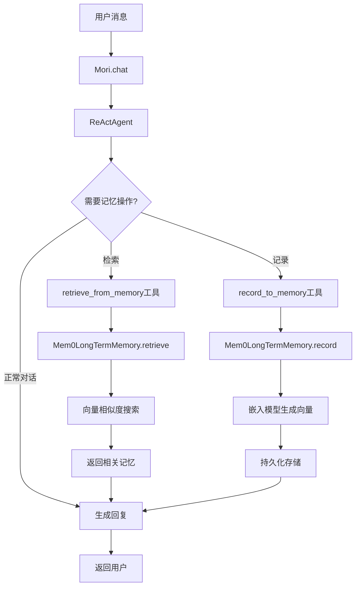

# Mori 长期记忆功能实施计划

## 概述

为 Mori 项目添加基于 AgentScope mem0 的长期记忆支持，使 Agent 能够记住用户的偏好、习惯和历史对话信息。

## 需求确认

- **记忆管理模式**: `agent_control` - Agent 自主管理记忆
- **嵌入模型**: 支持多种嵌入模型（DashScope、OpenAI、Gemini、Ollama）
- **存储方式**: `on_disk=True` - 持久化存储
- **用户标识**: 从配置文件读取 `user_name`

## 架构设计

### 1. 配置系统扩展

#### 1.1 EmbeddingModelConfig 类

```python
class EmbeddingModelConfig(BaseModel):
    """嵌入模型配置"""
    model_name: str = Field(..., description="嵌入模型名称")
    model_type: str = Field(..., description="嵌入模型类型")
    api_key: Optional[str] = Field(None, description="API密钥")
    dimensions: Optional[int] = Field(None, description="向量维度")
    generate_kwargs: Optional[Dict[str, Any]] = Field(
        default_factory=dict, description="生成参数"
    )
```

#### 1.2 AgentConfig 扩展

```python
class AgentConfig(BaseModel):
    # ... 现有字段 ...

    # 长期记忆配置
    long_term_memory: Optional[Dict[str, Any]] = Field(
        None,
        description="长期记忆配置"
    )
    # 示例配置结构:
    # long_term_memory:
    #   enabled: true
    #   mode: "agent_control"  # agent_control, static_control, both
    #   user_name: "user_123"
    #   embedding_model: "text-embedding-v2"  # 引用 models.yaml 中的嵌入模型
    #   storage_path: "data/memory"  # 持久化存储路径
    #   on_disk: true
```

### 2. 嵌入模型创建

在 [`mori.py`](../mori/mori.py) 中添加 `_create_embedding_model` 方法：

```python
def _create_embedding_model(self, embedding_model_name: str):
    """创建嵌入模型实例

    支持的模型类型:
    - DashScope: DashScopeTextEmbedding
    - OpenAI: OpenAITextEmbedding
    - Gemini: GeminiTextEmbedding
    - Ollama: OllamaTextEmbedding
    """
    # 从 models.yaml 中查找嵌入模型配置
    # 根据 model_type 创建对应的嵌入模型实例
```

### 3. 长期记忆创建

在 [`mori.py`](../mori/mori.py) 中添加 `_create_long_term_memory` 方法：

```python
def _create_long_term_memory(self):
    """创建长期记忆实例

    使用 Mem0LongTermMemory:
    - agent_name: 从 agent_config 获取
    - user_name: 从 long_term_memory 配置获取
    - model: 使用主模型
    - embedding_model: 使用配置的嵌入模型
    - on_disk: True
    - storage_path: 从配置获取
    """
```

### 4. Agent 工厂函数修改

修改 [`factory.py`](../mori/agent/factory.py) 中的 `create_mori_agent` 函数：

```python
def create_mori_agent(
    name: str,
    sys_prompt: str,
    model: ChatModelBase,
    formatter,
    toolkit: Optional[Toolkit] = None,
    parallel_tool_calls: bool = False,
    long_term_memory = None,  # 新增参数
    long_term_memory_mode: str = "agent_control",  # 新增参数
    **kwargs,
) -> ReActAgent:
    # 传递 long_term_memory 和 long_term_memory_mode 给 ReActAgent
```

## 配置文件示例

### models.yaml 扩展

```yaml
models:
  # ... 现有模型配置 ...

  # 嵌入模型配置
  - model_name: text-embedding-v2
    model_type: dashscope
    api_key: ${DASHSCOPE_API_KEY}

  - model_name: text-embedding-3-small
    model_type: openai
    api_key: ${OPENAI_API_KEY}
    generate_kwargs:
      dimensions: 1536

  - model_name: text-embedding-004
    model_type: gemini
    api_key: ${GEMINI_API_KEY}

  - model_name: nomic-embed-text
    model_type: ollama
    base_url: http://localhost:11434
```

### agents.yaml 扩展

```yaml
agents:
  - name: mori
    model: gpt-4
    template: mori
    sys_prompt: null
    memory_config:
      type: memory
      max_length: 100
    parallel_tool_calls: true

    # 长期记忆配置
    long_term_memory:
      enabled: true
      mode: "agent_control"
      user_name: "default_user"
      embedding_model: "text-embedding-v2"
      storage_path: "data/memory"
      on_disk: true
```

## 系统提示词更新

在 [`mori.jinja2`](../mori/template/internal_template/mori.jinja2) 中添加长期记忆使用说明：

```jinja2
## 记忆管理能力

你具有长期记忆功能，可以记住用户的偏好、习惯和重要信息。

### 记忆管理指南

1. **记录记忆**: 当用户分享个人信息、偏好、习惯或关于自己的事实时，
   使用 `record_to_memory` 工具记录这些信息。

2. **检索记忆**: 在回答关于用户偏好、过去信息或个人详细信息的问题之前，
   使用 `retrieve_from_memory` 工具检查是否有相关的存储信息。

3. **何时使用**:
   - 用户询问"我喜欢什么？"、"我的偏好是什么？"
   - 用户提到之前说过的信息
   - 需要个性化响应时

在声称不了解用户的某些信息之前，始终先检查长期记忆。
```

## 数据流程图



## 实施步骤

### 阶段 1: 配置系统 (步骤 1-2)
- 创建 `EmbeddingModelConfig` 类
- 扩展 `AgentConfig` 添加长期记忆配置字段

### 阶段 2: 核心功能 (步骤 3-6)
- 实现 `_create_embedding_model` 方法
- 实现 `_create_long_term_memory` 方法
- 修改 `create_mori_agent` 工厂函数
- 在 `Mori.__init__` 中集成长期记忆

### 阶段 3: 模板和配置 (步骤 7-9)
- 更新 `mori.jinja2` 模板
- 更新 `models.yaml.example`
- 更新 `agents.yaml.example`

### 阶段 4: 测试和文档 (步骤 10-12)
- 创建测试用例
- 更新 `AGENTS.md`
- 创建使用文档

## 关键技术点

### 1. 嵌入模型映射

```python
EMBEDDING_MODEL_MAP = {
    "dashscope": DashScopeTextEmbedding,
    "openai": OpenAITextEmbedding,
    "gemini": GeminiTextEmbedding,
    "ollama": OllamaTextEmbedding,
}
```

### 2. 存储路径管理

```python
storage_path = Path(ltm_config.get("storage_path", "data/memory"))
storage_path.mkdir(parents=True, exist_ok=True)
```

### 3. 异步支持

长期记忆的 `record` 和 `retrieve` 方法都是异步的，需要使用 `await`。

### 4. 错误处理

- 嵌入模型配置不存在
- 存储路径创建失败
- API 密钥缺失
- 网络连接问题

## 测试策略

### 单元测试
- 配置加载测试
- 嵌入模型创建测试
- 长期记忆实例化测试

### 集成测试
- 记录和检索功能测试
- 多用户隔离测试
- 持久化存储测试

### 端到端测试
- 完整对话流程测试
- Agent 自主记忆管理测试

## 依赖项

确保 `pyproject.toml` 中包含必要的依赖：

```toml
[project]
dependencies = [
    "agentscope>=0.1.0",  # 包含 mem0 支持
    # ... 其他依赖
]
```

## 注意事项

1. **性能考虑**: 嵌入模型调用会增加延迟，建议使用缓存
2. **存储空间**: 持久化存储会占用磁盘空间，需要定期清理
3. **隐私保护**: 用户数据需要妥善保管，考虑加密存储
4. **多用户支持**: 通过 `user_name` 区分不同用户的记忆

## 后续优化

- [ ] 添加记忆清理和管理接口
- [ ] 支持记忆导出和导入
- [ ] 添加记忆统计和分析功能
- [ ] 实现记忆压缩和归档
- [ ] 支持多模态记忆（图片、音频等）
